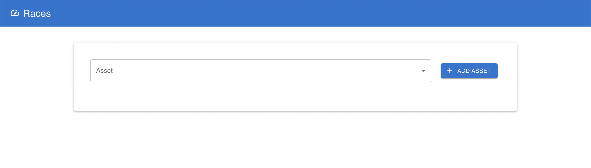
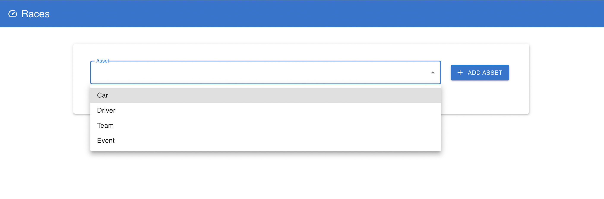
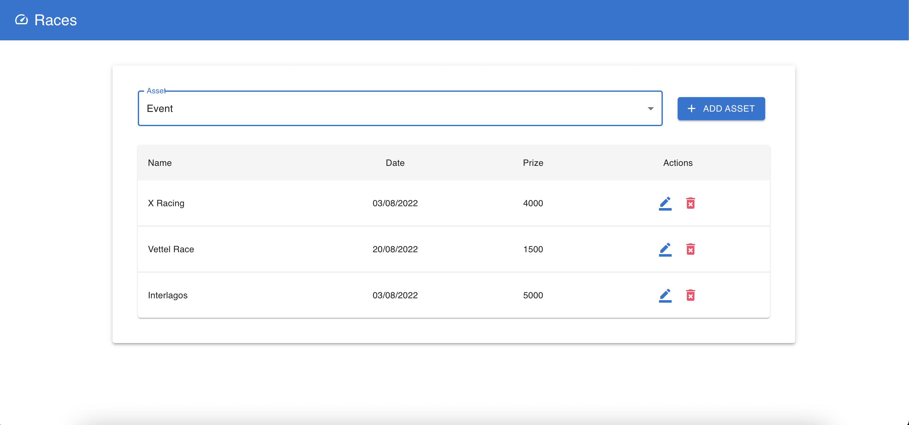
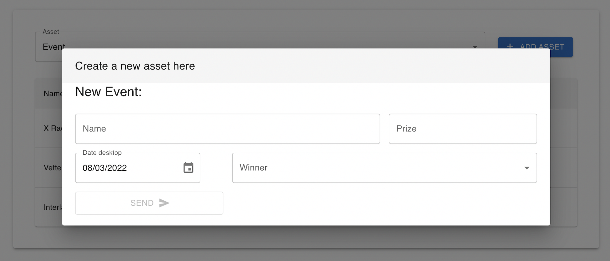
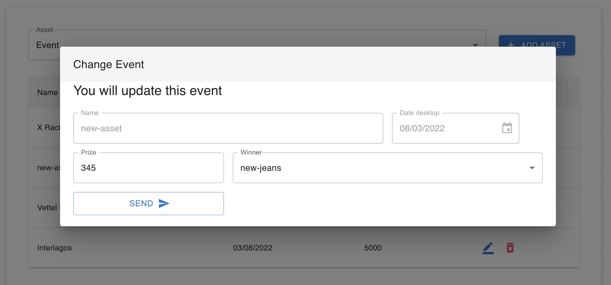
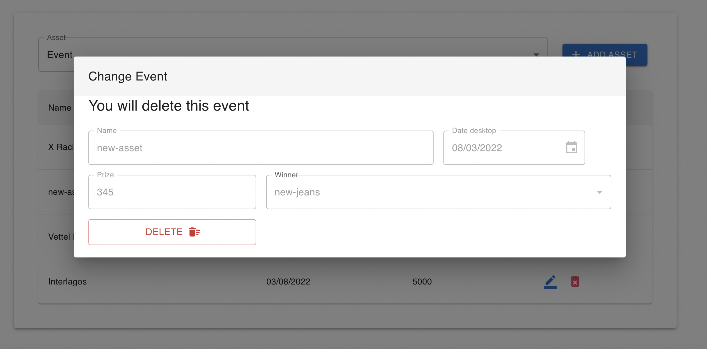

## Initial page

You can search for assets selecting then:

<!--  -->

## Assets list

You can interact with asset (update or delete):

## Crete new asset

You can create a new asset pressing the button "add asset":

## Update asset

You can update asset pressing the blue icon next to the asset:

## Delete asset

You can delete asset pressing the red icon next to the asset:

